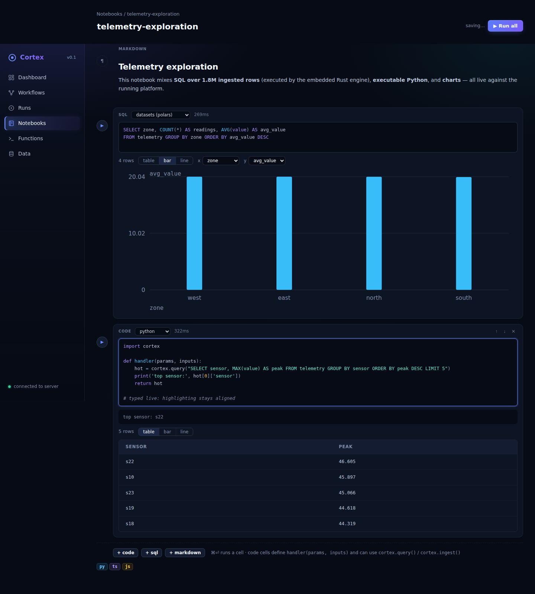
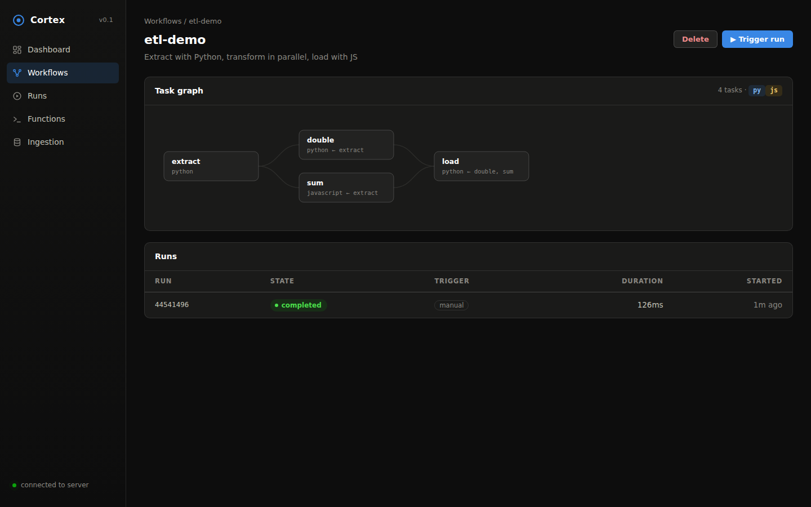
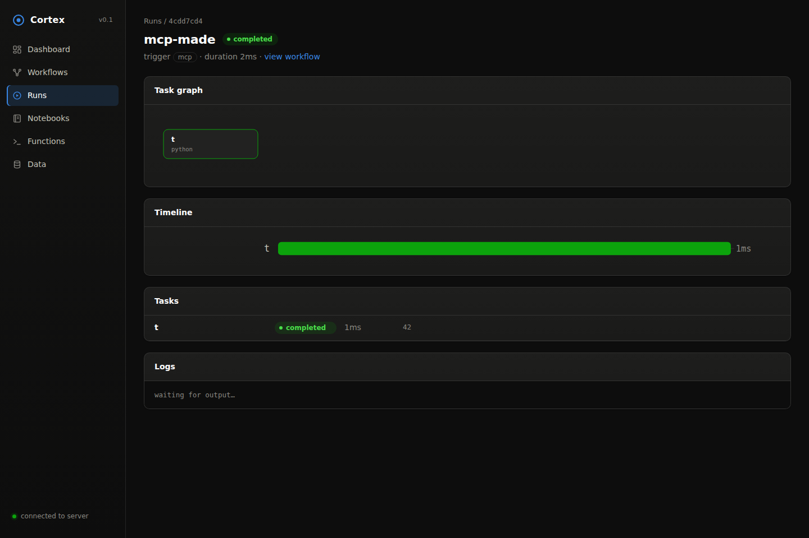
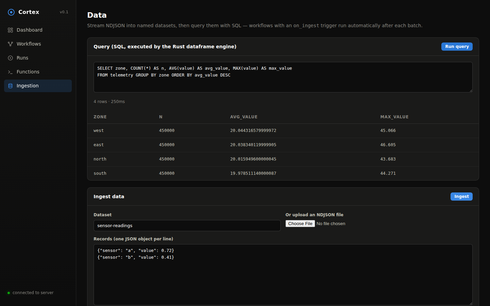

# Rust Orchestrator

**A Rust-native orchestration platform for Python and TypeScript workloads** —
workflow DAGs, streaming data ingestion, serverless functions, and a live
console. Think Prefect/Airflow ergonomics with a single static Rust binary at
the core.


## What it does

- **Workflow orchestration** — define DAGs of tasks, each task written in
  **Python, TypeScript, or JavaScript**. The Rust core validates the graph,
  topologically schedules it, runs independent tasks **in parallel**, and pipes
  each task's result into its dependents — across language boundaries (a
  Python task's output becomes a TypeScript task's input).
- **Process-isolated execution** — every task runs in its own OS process with
  a JSON-lines protocol over stdio. Timeouts kill runaway workloads; retries
  are per-task; logs stream back live.
- **Streaming everything** — run state, task state, and log lines broadcast
  over **SSE** (`/api/events`, `/api/runs/{id}/events`). Ingestion accepts
  **streamed NDJSON** bodies of any size without buffering them in memory.
- **Serverless functions** — deploy a named Python/TS/JS handler, invoke it
  over HTTP (`/api/functions/{name}/invoke`), or stream its logs + result via
  SSE. Invocation counts tracked per function.
- **SQL dataframe engine** — every ingested dataset is queryable with SQL,
  executed in-process by [Polars](https://pola.rs) (a Rust dataframe engine):
  `POST /api/query`, `client.query(...)` in both SDKs, a query panel in the
  console, and — inside any task or function — `cortex.query(...)` bindings,
  so workloads aggregate millions of rows in Rust without pandas installed.
- **Triggers** — manual, interval (`every_secs`), or data-driven
  (`on_ingest: dataset` runs the workflow after every ingest batch).
- **Direct execution API** — `POST /api/execute` runs any Python/TS/JS
  snippet on the warm worker pool and returns result + logs in ~1 ms
  overhead. The building block for notebooks and agents.
- **Notebooks** — Observable-style executable documents in the console:
  markdown, code cells (any runtime), SQL cells, and charts in between.
  Cells run against the live platform and results persist with the document.
- **External engines** — register **Postgres**, **ClickHouse**, or **chDB**
  (embedded ClickHouse) connectors and point any query — API, SDK, notebook
  cell, console — at them with `{"connector": "name"}`.
- **MCP server** — `POST /mcp` speaks the Model Context Protocol
  (streamable HTTP), exposing 13 tools (create/trigger workflows, execute
  code, SQL, ingest, functions, notebooks) so AI agents can drive the whole
  platform: `claude mcp add --transport http cortex http://localhost:7420/mcp`.
- **SDKs** — [Python](sdks/python) (`@task` decorators, zero deps) and
  [TypeScript](sdks/typescript) (`task()`/`flow()` builders, zero deps).
- **Console** — a dark, real-time React UI: DAG viewer, run Gantt timeline,
  live logs, 24h activity chart, notebooks, function playground, data
  manager with SQL editor.



| Workflow DAG | Live run |
| --- | --- |
|  |  |



## Architecture

```
┌────────────────────────── console (React + Vite) ──────────────────────────┐
│   Dashboard · Workflows/DAG · Runs (live SSE) · Functions · Ingestion      │
└──────────────────────────────────┬──────────────────────────────────────────┘
                                   │ REST + SSE
┌──────────────────────────────────▼──────────────────────────────────────────┐
│                        cortex-server (Rust, axum)                           │
│  ┌────────────┐  ┌───────────┐  ┌───────────┐  ┌───────────────────────┐   │
│  │ REST + SSE │  │ scheduler │  │ ingestion │  │ serverless functions  │   │
│  └─────┬──────┘  └─────┬─────┘  └─────┬─────┘  └───────────┬───────────┘   │
│        └───────────────┴──── orchestrator (DAG, retries) ──┘               │
└────────┬─────────────────────────────┬─────────────────────────────────────┘
         │                             │
┌────────▼─────────┐        ┌──────────▼──────────────────────────────────────┐
│   cortex-store   │        │              cortex-executor                    │
│ (SQLite, WAL)    │        │  worker processes, JSON-lines over stdio        │
└──────────────────┘        │  ┌─────────────┐  ┌───────────────────────────┐ │
                            │  │ python3     │  │ node (TS type-stripping)  │ │
                            │  │ worker.py   │  │ worker.mjs                │ │
                            │  └─────────────┘  └───────────────────────────┘ │
                            └─────────────────────────────────────────────────┘
       ▲                                      ▲
┌──────┴────────┐                     ┌───────┴────────┐
│  cortex-sdk   │                     │  @cortex/sdk   │
│  (Python)     │                     │  (TypeScript)  │
└───────────────┘                     └────────────────┘
```

Crates:

| Crate | Role |
| --- | --- |
| [`cortex-core`](crates/cortex-core) | Domain model: workflows, tasks, runs, events, DAG validation + layering |
| [`cortex-store`](crates/cortex-store) | Embedded SQLite persistence (WAL), stats |
| [`cortex-executor`](crates/cortex-executor) | Process-isolated Python/Node workers, streamed logs, timeouts |
| [`cortex-server`](crates/cortex-server) | axum API, orchestrator, scheduler, SSE, ingestion, functions |

## Quickstart

Requirements: Rust 1.80+, Python 3.10+, Node 20+ (22+ for TypeScript tasks).

```bash
# 1. Run the server (API on :7420)
cargo run --release -p cortex-server

# 2. Build + serve the console through the server
cd console && npm install && npm run build && cd ..
# restart the server — it auto-serves console/dist at http://localhost:7420

# — or for frontend development with hot reload:
cd console && npm run dev        # console on :3001, proxies /api to :7420
```

Or with Docker:

```bash
docker compose up --build        # everything on http://localhost:7420
```

### Deploy on Coolify

1. **+ New Resource → Docker Compose**, point it at this repository.
2. Set **Docker Compose Location** to `/docker-compose.coolify.yml`.
3. Assign a domain on the resource (or let Coolify generate one) — the
   `SERVICE_FQDN_CORTEX_7420` magic variable routes Coolify's proxy to the
   server, SSE included. Data persists in the `cortex-data` volume and the
   healthcheck drives status/rolling restarts.

The API has no authentication (trusted single-tenant): keep the resource
internal, or front it with Coolify's access controls before exposing it.

### Your first workflow (curl)

```bash
curl -X POST localhost:7420/api/workflows -H 'content-type: application/json' -d '{
  "name": "hello-pipeline",
  "params": {"n": 100},
  "tasks": [
    {"id": "extract", "runtime": "python", "depends_on": [],
     "code": "def handler(params, inputs):\n    return {\"values\": list(range(params[\"n\"]))}\n"},
    {"id": "total", "runtime": "typescript", "depends_on": ["extract"],
     "code": "export function handler(params: any, inputs: any) {\n  return inputs.extract.values.reduce((a: number, b: number) => a + b, 0);\n}\n"}
  ]
}'

curl -X POST localhost:7420/api/workflows/<id>/trigger -H 'content-type: application/json' -d '{}'
curl localhost:7420/api/runs/<run_id>          # → task results, logs, states
curl -N localhost:7420/api/events              # → live SSE stream
```

### Your first workflow (Python SDK)

```python
from cortex_sdk import CortexClient, Flow, task

@task
def extract(params, inputs):
    return {"values": list(range(params["n"]))}

@task(depends_on=[extract])
def total(params, inputs):
    return sum(inputs["extract"]["values"])

client = CortexClient("http://localhost:7420")
wf = client.deploy(Flow("hello-pipeline", params={"n": 100}, tasks=[extract, total]))
run = client.trigger(wf["id"], wait=True)      # → state: completed
```

See [`examples/`](examples) for runnable Python and TypeScript pipelines, and
the SDK READMEs for streaming, functions, and ingestion.

## HTTP API

| Method & path | Description |
| --- | --- |
| `GET /api/healthz` | Liveness |
| `GET /api/stats` | Aggregate counters |
| `GET/POST /api/workflows` | List / create (DAG-validated) |
| `GET/PUT/DELETE /api/workflows/{id}` | Read / update / delete |
| `POST /api/workflows/{id}/trigger` | Start a run (`{"params": {...}}`) |
| `GET /api/runs?workflow_id&limit` | Run history |
| `GET /api/runs/{id}` | Run + task states, results, logs |
| `GET /api/events`, `GET /api/runs/{id}/events` | **SSE** live event streams |
| `GET/POST /api/functions` | List / deploy serverless functions |
| `GET/DELETE /api/functions/{name}` | Read / remove |
| `POST /api/functions/{name}/invoke` | Invoke, JSON result + logs |
| `POST /api/functions/{name}/invoke/stream` | Invoke, **SSE** logs then result |
| `GET /api/datasets` | Ingested datasets |
| `POST /api/ingest/{dataset}` | **Streaming** NDJSON ingestion |
| `POST /api/query` | SQL via embedded Polars, or `{"connector": name}` for Postgres/ClickHouse/chDB |
| `POST /api/execute` | Run a Python/TS/JS snippet on the warm pool (`{"runtime", "code", "params"}`) |
| `GET/POST /api/connectors`, `DELETE /api/connectors/{name}` | External engine registry |
| `GET/POST /api/notebooks`, `GET/PUT/DELETE /api/notebooks/{id}` | Notebook documents |
| `POST /mcp` | Model Context Protocol endpoint (13 tools for AI agents) |

## Writing tasks

A task is a self-contained module with one exported entrypoint:

```python
# runtime: python
def handler(params, inputs):
    # params: run params merged with task params
    # inputs: {upstream_task_id: its_result}
    print("logs stream live to the console")
    return {"any": "json"}
```

```ts
// runtime: typescript (Node 22 type-stripping) or javascript
export async function handler(params: any, inputs: any) {
  console.log("logs stream live");
  return { any: "json" };
}
```

Per-task knobs: `depends_on`, `retries`, `timeout_secs`, `params`. Workflow
knobs: `max_parallel_tasks`, `triggers.every_secs`, `triggers.on_ingest`.

Every task and function also gets **in-task platform bindings** — `import
cortex` in Python, the `cortex` global in JS/TS — for querying data on the
Rust engine, ingesting results, and invoking functions:

```python
import cortex

def handler(params, inputs):
    rows = cortex.query("""
        SELECT zone, AVG(value) AS avg_value, COUNT(*) AS n
        FROM telemetry WHERE value > 10 GROUP BY zone
    """)
    cortex.ingest("zone-aggregates", rows)
    return {"zones": len(rows)}
```

## Development

Full environment setup, the Rust rebuild loop, and troubleshooting live in
[docs/development.md](docs/development.md). The short version:

```bash
cargo test --workspace      # Rust: DAG, store, executor (spawns real workers), orchestrator
cargo clippy --workspace
cd console && npm run typecheck && npm run build
cd sdks/typescript && npm run build
```

Configuration (env vars): `CORTEX_PORT` (7420), `CORTEX_DATA_DIR` (`./data`),
`CORTEX_CONSOLE_DIST` (`./console/dist`), `CORTEX_PYTHON_BIN` (`python3`),
`CORTEX_NODE_BIN` (`node`), `RUST_LOG` (`info`).

## Performance

Measured on a modest dev container (release build, SQLite store, real Python
3.11 / Node 22 workers):

| Operation | p50 latency / throughput |
| --- | --- |
| Control-plane API call (`GET /api/stats`) | **0.6 ms** |
| Serverless invoke, Python | **1.2 ms** |
| Serverless invoke, JavaScript / TypeScript | **1.3 / 1.6 ms** |
| 3-task workflow (py → py → js), end to end | **7.4 ms** |
| Sustained parallel invocations (32 concurrent) | **~775 invocations/s** |
| Streaming NDJSON ingestion | **~780 MB/s** (1.7M records/100 MB in 0.13 s) |

The number that makes this possible is the **warm worker pool**: interpreters
are reused across tasks (the shims loop over jobs on stdin), so the
30–115 ms interpreter startup cost is paid once, not per task. Pooling is
automatic in `process` isolation mode; disable with `CORTEX_WORKER_POOL=0`,
tune with `CORTEX_WORKER_MAX_IDLE` (8 idle workers kept per runtime) and
`CORTEX_WORKER_MAX_JOBS` (retire a worker after 128 jobs). Container and
microVM modes intentionally never pool — a fresh sandbox per task is their
purpose.

## Workload isolation

Workers run at one of three isolation tiers, selected with `CORTEX_ISOLATION`.
All tiers speak the same stdio protocol — the orchestrator doesn't care which
one is active.

| Mode | What runs | Use when |
| --- | --- | --- |
| `process` (default) | direct child processes | trusted, single-tenant, lowest latency |
| `container` | one `docker`/`podman run --rm` per task: no network, read-only rootfs, memory/CPU/pid limits | semi-trusted code, dependency isolation |
| `microvm` | same container interface executed by a VM-backed OCI runtime (Kata Containers, Firecracker via `kata-fc`/firecracker-containerd) — each task gets its own guest kernel | untrusted / multi-tenant workloads |

```bash
# containers
CORTEX_ISOLATION=container cargo run -p cortex-server

# microVMs (requires a VM runtime registered with your engine, e.g. Kata)
CORTEX_ISOLATION=microvm CORTEX_VM_RUNTIME=io.containerd.kata.v2 cargo run -p cortex-server
```

Container/microVM knobs: `CORTEX_CONTAINER_ENGINE` (`docker`),
`CORTEX_VM_RUNTIME` (`kata` when mode is `microvm`), `CORTEX_PYTHON_IMAGE`
(`python:3.12-slim`), `CORTEX_NODE_IMAGE` (`node:22-slim`),
`CORTEX_WORKER_MEMORY` (`512m`), `CORTEX_WORKER_CPUS` (`1`). Timed-out
workers are killed by container name so nothing is orphaned.

## Repository layout

```
crates/            Rust workspace (core, store, executor, server)
console/           React + Vite console
sdks/python/       cortex-sdk (zero-dep Python bindings)
sdks/typescript/   @cortex/sdk (zero-dep TS bindings)
examples/          Runnable example pipelines
docs/              Architecture notes & screenshots
site/              Landing page (single self-contained HTML — host it anywhere)
```
